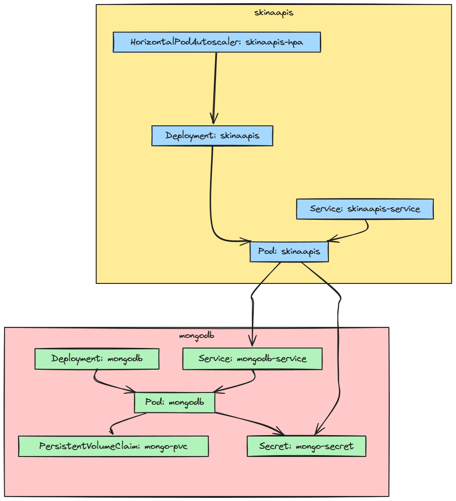

# Skina Lanches Management API

## Overview

The Skina Lanches Management API is designed to facilitate the management of products, categories, clients, and orders for a sandwich shop. The API provides endpoints to create, read, update, and delete entities within the system.
This project follows a hexagonal architecture and is based on a DDD (Domain driven design) generated from event storming in which the steps can be analyzed in: https://miro.com/app/board/uXjVKTBf0pw=/?share_link_id=516597082495
The image for this project is also available on docker hub: https://hub.docker.com/r/mrcsfritsch/skinaapis

## Table of Contents

- [Skina Lanches Management API](#skina-lanches-management-api)
  - [Overview](#overview)
  - [Table of Contents](#table-of-contents)
  - [Setup](#setup)
    - [Docker Setup](#docker-setup)
    - [Compose Setup](#compose-setup)
  - [Integrated testing via Swagger](#integrated-testing-via-Swagger)
  - [API Endpoints](#api-endpoints)
    - [Categories](#categories)
    - [Products](#products)
    - [Clients](#clients)
    - [Orders](#orders)
    - [Payment](#payment)
  - [Kubernetes Structure Description](#kubernetes-structure-description)
    - [MongoDB](#mongodb)
    - [Skinaapis](#Skinaapis)
    - [Interconnections](#interconnections)    
  -[Guide for Running the Application with Kubernetes](#guide-for-running-the-application-with-kubernetes)
    - [Prerequisites](#prerequisites)
    - [Example Directory Structure](#directory-structure)
    - [Step 1: Fast Running](#step-1-fast-running)
    - [Step 2: Verify Deployments and Services](#step-2-verify-deployments-and-services)
    - [Step 3: Clean Up Resources](#step-3-clean-up-resources)

## Setup

### Docker Setup

To set up the application using Docker and building the image from this repository, follow these steps:

1. Ensure you have Docker installed on your machine and be logged into a registry (optional).
2. Ensure you have a mongodb installation.
3. Clone the repository to your local machine.
4. Navigate to the project directory.
5. Build the Docker image using the provided Dockerfile:
   ```sh
   docker build -t yourRepository/skina-lanches-api:version .
6. Run the Docker container:
    ```sh
    docker run -p 9090:9090 -e MONGO_USER=user -e MONGO_PASSWORD=password -e MONGO_PORT=port -e MONGO_HOST=localhost -e MONGO_DATABASE=database yourRepository/skina-lanches-api:version
7. Uploading the image to a registry:
   ```sh
    docker push yourRepository/skina-lanches-api:version

To set up the application using Docker using the official image available on docker hub, follow these steps:

1. Ensure you have Docker installed on your machine.
2. Download the image:
   ```sh
   docker pull mrcsfritsch/skinaapis
3. Ensure you have a mongodb installation.
4. Run the Docker container:
    ```sh
    docker run -p 9090:9090 -e MONGO_USER=user -e MONGO_PASSWORD=password -e MONGO_PORT=port -e MONGO_HOST=localhost -e MONGO_DATABASE=database mrcsfritsch/skinaapis
   
### Compose Setup

To set up the application using Docker compose, follow these steps:

1. Ensure you have Docker engine and docker compose installed on your machine.
2. Navigate to the compose directory.
3. Edit the .env file, setting the environment variables as desired
4. Start service from docker compose file, must be in the compose directory:
   ```sh
   docker compose up -d

## Integrated testing via Swagger  

1. Access the skinaapis service address with the port defined in the .env file:
   http://127.0.0.1:9090/docs/index.html#/
2. Add a client via the "post" method using the endpoint [Clients](#clients).
3. Get the category id that you will use when inserting a product, using the endpoint get method [Categories](#categories) 
4. Add a product via the "post" method using the endpoint [Products](#products)
5. Get the ids of the products that you will insert in your order, using the endpoint's get method [Products](#products), it is possible via query param to search by category.
6. Add a request via the "post" method using the endpoint [Orders](#orders)
7. Simulate a fake checkout through the endpoint using method post [FakeCheckout](#fakeCheckout), this will change the order status to finished.

Obs.: Through swagger for more details about the APIs

## API Endpoints

### Categories

- **GET /categories**
  - Retrieves a paginated list of categories.
  - Parameters:
    - `page` (integer, default: 1): Page number for pagination.
    - `pageSize` (integer, default: 10): Number of categories per page.
  - Responses:
    - `200`: Successfully retrieved list of categories.
    - `500`: Internal server error if there is a problem on the server side.

- **POST /categories**
  - Adds a new category to the database.
  - Body: `dto.CreateCategoryRequest`
  - Responses:
    - `201`: Successfully created category.
    - `400`: Bad request if the category data is invalid.
    - `500`: Internal server error if there is a problem on the server side.

- **GET /categories/{id}**
  - Retrieves details of a category by its ID.
  - Parameters:
    - `id` (string): Category ID.
  - Responses:
    - `200`: Successfully retrieved the category details.
    - `400`: Bad request if the ID is not provided or invalid.
    - `404`: Category not found if the ID does not match any category.
    - `500`: Internal server error if there is a problem on the server side.

- **PUT /categories/{id}**
  - Replaced category by its ID.
  - Parameters:
    - `id` (string): Category ID.
  - Body: `dto.CreateCategoryRequest`
  - Responses:
    - `200`: Successfully updated category.
    - `400`: Invalid input, object is invalid.
    - `404`: Category not found.
    - `500`: Internal server error.

- **DELETE /categories/{id}**
  - Deletes a category by its ID.
  - Parameters:
    - `id` (string): Category ID.
  - Responses:
    - `200`: Message indicating successful deletion.
    - `400`: Bad request if the ID is not provided or is invalid.
    - `404`: Category not found if the ID does not match any category.
    - `500`: Internal server error if there is a problem deleting the category.
- **Patch /categories/{id}**
  - Update a category by its ID.
  - Parameters:
    - `id` (string): Category ID.
  - Responses:
    - `200`: Message indicating successful deletion.
    - `400`: Bad request if the ID is not provided or is invalid.
    - `404`: Category not found if the ID does not match any category.
    - `500`: Internal server error if there is a problem deleting the category.
### Products

- **GET /products**
  - Retrieves a paginated list of products, optionally filtered by category.
  - Parameters:
    - `category` (string, optional): Filter by category ID.
    - `page` (integer, default: 1): Page number for pagination.
    - `pageSize` (integer, default: 10): Number of products per page.
  - Responses:
    - `200`: Successfully retrieved list of products.
    - `500`: Internal server error if there is a problem on the server side.

- **POST /products**
  - Adds a new product to the database.
  - Body: `dto.CreateProductRequest`
  - Responses:
    - `201`: Product successfully created.
    - `400`: Bad request if the product data is invalid.
    - `500`: Internal server error if there is a problem on the server side.

- **GET /products/{id}**
  - Retrieves details of a product by its ID.
  - Parameters:
    - `id` (string): Product ID.
  - Responses:
    - `200`: Successfully retrieved the product details.
    - `400`: Bad request if the ID is not provided or invalid.
    - `404`: Product not found if the ID does not match any product.
    - `500`: Internal server error if there is a problem on the server side.

- **PUT /products/{id}**
  - Replaced product by its ID.
  - Parameters:
    - `id` (string): Product ID.
  - Body: `dto.CreateProductRequest`
  - Responses:
    - `200`: Product successfully updated.
    - `400`: Invalid input, object is invalid.
    - `404`: Product not found.
    - `500`: Internal server error.
- **PATCH /products/{id}**
  - Updates product details by its ID.
  - Parameters:
    - `id` (string): Product ID.
  - Body: `dto.CreateProductRequest`
  - Responses:
    - `200`: Product successfully updated.
    - `400`: Invalid input, object is invalid.
    - `404`: Product not found.
    - `500`: Internal server error.

- **DELETE /products/{id}**
  - Deletes a product by its ID.
  - Parameters:
    - `id` (string): Product ID.
  - Responses:
    - `200`: Message indicating successful deletion.
    - `400`: Bad request if the ID is not provided or is invalid.
    - `404`: Product not found if the ID does not match any product.
    - `500`: Internal server error if there is a problem deleting the product.
      
### Clients

- **POST /clients**
  - Adds a new client to the database.
  - Body: `dto.CreateClientRequest`
  - Responses:
    - `201`: Client successfully created.
    - `400`: Bad request if the client data is invalid.
    - `500`: Internal server error if there is a problem on the server side.

- **GET /clients/{cpf}**
  - Retrieves details of a client by its CPF.
  - Parameters:
    - `cpf` (string): Client CPF.
  - Responses:
    - `200`: Successfully retrieved the client details.
    - `400`: Bad request if the CPF is not provided or invalid.
    - `404`: Client not found if the CPF does not match any client.
    - `500`: Internal server error if there is a problem on the server side.

### Orders

- **GET /orders**
  - Retrieves a paginated list of orders.
  - Parameters:
    - `page` (integer, default: 1): Page number for pagination.
    - `pageSize` (integer, default: 10): Number of orders per page.
  - Responses:
    - `200`: Successfully retrieved list of orders.
    - `500`: Internal server error if there is a problem on the server side.

- **POST /orders**
  - Adds a new order to the database.
  - Body: `dto.CreateOrderRequest`
  - Responses:
    - `201`: Successfully created order.
    - `400`: Bad request if the order data is invalid.
    - `500`: Internal server error if there is a problem on the server side.

- **GET /orders/{id}**
  - Retrieves details of an order by its ID.
  - Parameters:
    - `id` (string): Order ID.
  - Responses:
    - `200`: Successfully retrieved the order details.
    - `400`: Bad request if the ID is not provided or invalid.
    - `404`: Order not found if the ID does not match any order.
    - `500`: Internal server error if there is a problem on the server side.
- **PATCH /orders/{id}/{status}**
  - Update the status of an order 
  - Parameters:
    - `id` (string): Order ID.
    - `status` (string): status.
  - Responses:
    - `200`: Successfully status updated.
    - `400`: Bad request if the Status is not provided or invalid
    - `500`: Internal server error if there is a problem on the server side.
      
### Payment

- **GET /payment/{id}**
  - Generates the qr code for payment via pix.
  - Parameters:
    - `id` (string): Order ID.
  - Responses:
    - `200`: Got qr code successfully.
    - `400`: Bad request if the ID is not provided or invalid.
    - `500`: Internal server error if there is a problem on the server side.

- **POST /payment**
  - Update payment status for the order based ID.
  - Body: `dto.paymentDTO`
  - Responses:
    - `200`: Got qr code successfully.
    - `400`: Bad request if the ID is not provided or invalid.
    - `500`: Internal server error if there is a problem on the server side.

## Kubernetes Structure Description



#### MongoDB

1. **Deployment: mongodb**
    
    - Defines a deployment named `mongodb` that manages the MongoDB pod.
2. **Pod: mongodb**
    
    - The deployment creates a pod named `mongodb`, which contains the MongoDB container.
    - The pod mounts a persistent volume (`mongo-pvc`) and uses secrets (`mongo-secret`) to configure MongoDB.
3. **PersistentVolumeClaim: mongo-pvc**
    
    - Defines a persistent volume that the MongoDB pod uses to store its data.
4. **Secret: mongo-secret**
    
    - Stores sensitive credentials, such as the MongoDB username and password, which are used by the MongoDB pod.
5. **Service: mongodb-service**
    
    - Defines a service that exposes the MongoDB pod, allowing other pods in the cluster to connect to MongoDB.

#### Skinaapis

1. **Deployment: skinaapis**
    
    - Defines a deployment named `skinaapis` that manages the `skinaapis` application pod.
2. **Pod: skinaapis**
    
    - The deployment creates a pod named `skinaapis`, which contains the `skinaapis` application container.
    - The pod uses secrets (`mongo-secret`) to configure the connection to MongoDB and connects to the `mongodb-service` to access the MongoDB database.
3. **Service: skinaapis-service**
    
    - Defines a service (not specified in the provided YAML but included in the description for completeness) that exposes the `skinaapis` application pod, allowing it to be accessed externally.
4. **HorizontalPodAutoscaler: skinaapis-hpa**
    
    - Defines a horizontal pod autoscaler for the `skinaapis` deployment, automatically adjusting the number of `skinaapis` pod replicas based on resource utilization (CPU and memory).

### Interconnections

- **Pods and Volumes**: The MongoDB pod mounts a persistent volume (`mongo-pvc`) for data storage.
- **Pods and Secrets**: Both the MongoDB pod and the `skinaapis` application pod use secrets (`mongo-secret`) for sensitive configurations.
- **Pods and Services**: The `skinaapis` application pod connects to the `mongodb-service` to access the MongoDB database.
- **Autoscaling**: The `HorizontalPodAutoscaler` adjusts the number of `skinaapis` pod replicas based on CPU and memory utilization.

### Guide for Running the Application with Kubernetes

Follow these steps to set up and run your application in a Kubernetes cluster.

#### Prerequisites

- Ensure you have a Kubernetes cluster running and `kubectl` installed and configured to interact with your cluster.

### Directory Structure

All your YAML files are in a directory named `kubernetes`:

```
kubernetes/
  ├── metrics-server-deployment.yaml
  ├── mongodb-secret.yaml
  ├── mongodb-pvc.yaml
  ├── mongodb-deployment.yaml
  ├── mongodb-service.yaml
  ├── skinaapis-deployment.yaml
  ├── skinaapis-service.yaml
  ├── skinaapis-hpa.yaml

```

#### Step 1: Fast Running

To apply all configurations in one go, you can use:

```sh
`kubectl apply -f kubernetes/`
```

#### Step 2: Verify Deployments and Services

Check the status of your deployments and services to ensure everything is running correctly.

```sh
`kubectl get deployments kubectl get pods kubectl get services kubectl get hpa`
```

#### Step 3: Clean Up Resources

If you need to delete all deployments, services, pods, HPAs, and PVCs, use the following commands:

```sh
`kubectl delete deployment --all kubectl delete svc --all kubectl delete pods --all kubectl delete hpa --all kubectl delete pvc --all`
```
